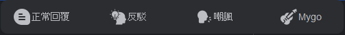
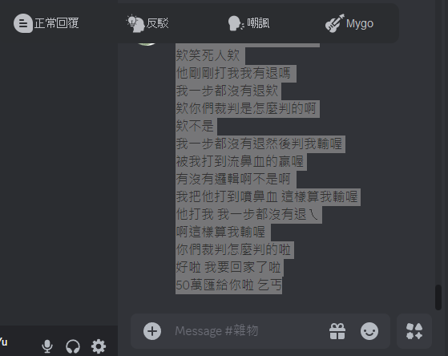
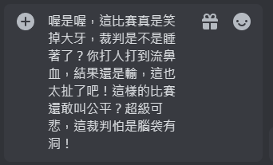

# Never Think Auto Reply

### 一個方便的快速回覆工具，搭配快捷鍵叫出，形成一個懶人回覆鏈
### 多種智慧回覆模式，包括自動MyGo、正常、反駁、嘲諷，全程無需使用者動腦



## 效果演示

https://youtu.be/bpvHgRAo-eE

[<video src='https://youtu.be/bpvHgRAo-eE' width=180/>](https://github.com/user-attachments/assets/d1a4e4d6-97b6-4c94-88d1-bd722eef82a0)




## 功能特點

- 全局快捷鍵叫出 (預設 Ctrl+Shift+X)
- 支援多種回覆模式：
  - 正常回覆
  - 反駁模式
  - 嘲諷模式
  - MyGO 表情貼圖
- 自動複製貼上功能
- 自動隱藏功能

## 安裝需求

```bash
pip install -r requirements.txt
```

主要依賴：

- PySide6
- keyboard
- pyperclip
- pyautogui
- pynput
- windows-toasts
- pywin32
- openai

## 前置準備

1. 右鍵使用記事本打開`config.ini` 並貼上OpenAI API Key：

```bash
[Keys]
openai = 你的OpenAI API Key
```

## (推薦)使用方法 1 - 已打包版本(從右側Release下載)

1. 運行程式：(建議)使用系統管理員 打開app.exe
2. 基本操作流程：
   - 反白要回覆的文字
   - 按下快捷鍵 `Ctrl+Shift+X` 叫出選單
   - 選擇回覆模式
   - 等待Windows通知提示出現(需等待0.5至5秒不等)
   - 點選要貼上的位置(輸入框)
   - 程式會自動處理並貼上回覆內容

## 開機自啟動設定
1. 右鍵使用記事本開啟`NTAR_Run.bat`
2. 將路徑替換為app.exe的絕對路徑 並儲存
3. 將`NTAR_Run.bat`移動至`C:\Users\你的使用者名稱\AppData\Roaming\Microsoft\Windows\Start Menu\Programs\Startup`

## 使用方法 2 - Clone Repo

1. 運行程式：

```bash
python app.py
```

2. 基本操作流程：
   - 反白要回覆的文字
   - 按下快捷鍵 `Ctrl+Shift+X` 叫出選單
   - 選擇回覆模式
   - 等待Windows通知提示出現(需等待0.5至5秒不等)
   - 點選要貼上的位置(輸入框)
   - 程式會自動處理並貼上回覆內容

## 系統需求

- 作業系統：Windows 10+

  或

- Python 3.9+

## 注意事項

- 程式可能需要管理員權限來監聽全局快捷鍵
- 請確保系統剪貼簿功能正常
- 首次運行 MyGO 表情貼圖功能時會自動創建下載目錄

## 自訂配置

您可以在config.ini中修改以下設定：

- 快捷鍵：修改 `hotkey` 參數
- GPT模型：修改 `gpt_model` 參數
- OpenAI金鑰：修改 `openai` 參數

## 問題回報

如果您在使用過程中遇到任何問題，請在 Issues 中回報。

## MyGO API使用

- https://mygo.miyago9267.com/
- https://github.com/miyago9267/MyGO-Searcher
